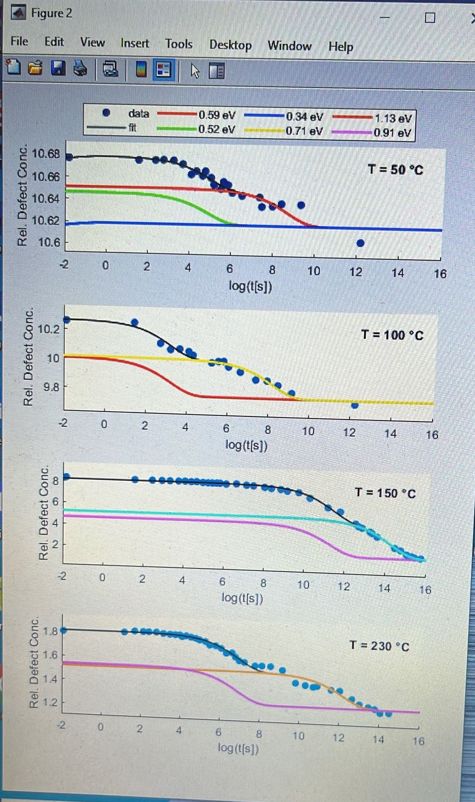

# Data Analysis of the Annealing of Solar Cells

Data analysis of solar cells to observe the effect of annealing on the activation energies of defects. This work is based on the publication : 

C. Brandt, C. Baur, A. Caon, P. Mueller-Buschbaum, C. Zimmermann and T. Andreev, "The influence of high temperatures on radiation damage of GaInP2/GaAs/Ge triple junction cells," 2012 IEEE 38th Photovoltaic Specialists Conference (PVSC) PART 2, Austin, TX, USA, 2012, pp. 1-6, doi: 10.1109/PVSC-Vol2.2012.6656726.
https://ieeexplore.ieee.org/document/6656726

Users can just run `main.m` in MATLAB and settings such as input directory, number of fitting iterations, etc. can be found and set in `config.m`.

