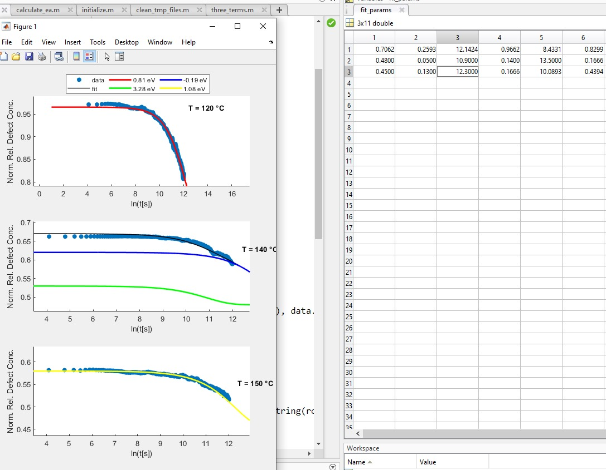

# Frequently Asked Questions

### Can I manually change the fit parameters in the case that the fit does not work for some reason?

Yes, you can. The fit parameters is stored in `fit_params`, you can access them in the workspace window (usually on the right of the GUI). The rows correspond to the temperatures based on the input in `config.m` and the columns correspond to $c_0$, $c_1$, $\tau_1$, ... , $c_5$ and $\tau_5$. In order to plot them without fitting, you can just run `plotting.m`.

Additionally the activation energies are saved in `ea_array`.

An example of how it looks like is shown below.

